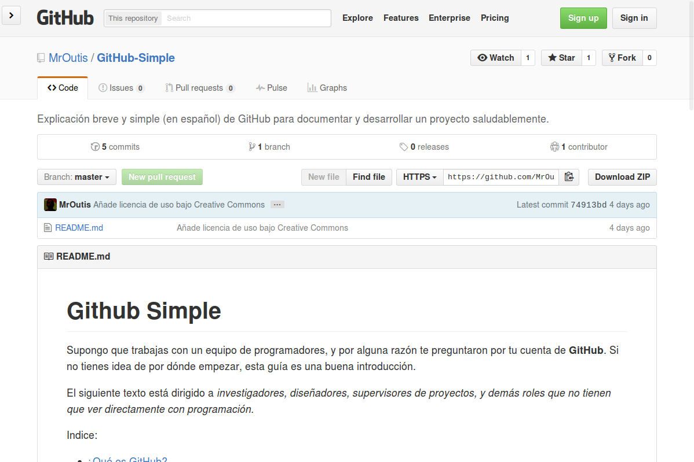
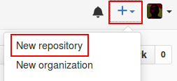
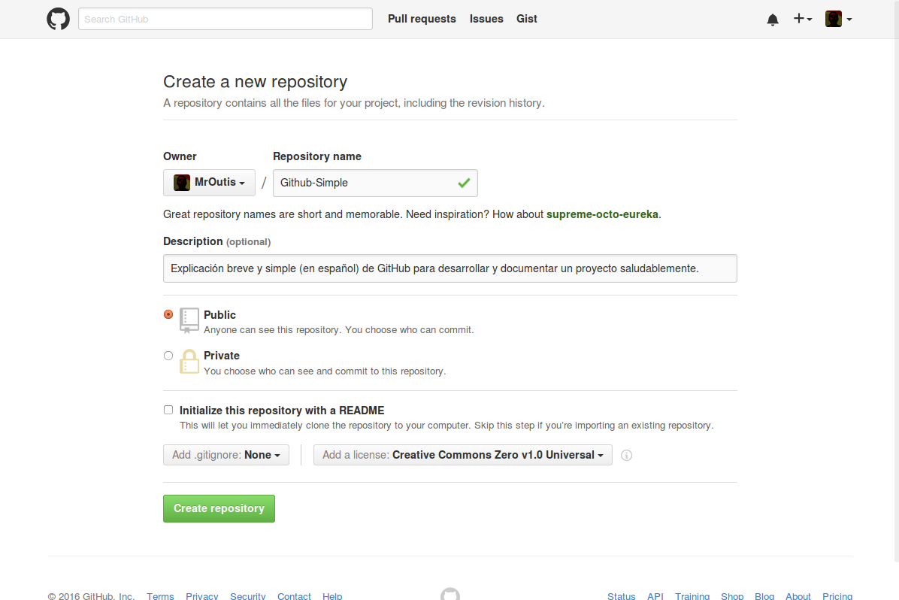

# rich1n.github.io
Repositorio de mi Landing page GitHub

# ¿Cómo utilizar GitHub?

Indice:
  - [¿Qué es GitHub?](#qu%C3%A9-es-github)
    + [¿Qué es Git?](#qu%C3%A9-es-git)
    + [¿Y el Hub?](#y-el-hub)
    + [¿Entonces...?](#entonces)
    + [¿Cómo hago una cuenta?](#c%C3%B3mo-hago-una-cuenta)
  - [Repositorios](#repositorios)
    + [Crea un repositorio](#crea-un-repositorio)
    + [Encabezado](#encabezado)
      * [Panel de Código](#panel-de-c%C3%B3digo)
    + [README](#readme)
      * [Desarrollo Guiado por README](#desarrollo-guiado-por-readme)
      * [Contenido de un README](#contenido-de-un-readme)
      * [Ejemplos de READMEs](#ejemplos-de-readmes)
  - [Gestionar un repositorio](#gestionar-un-repositorio)
    + [Issues](#issues)
    + [Labels](#labels)
    + [Milestones](#milestones)
    + [Herramientas alternativas](#herramientas-alternativas)
  - [Documentación](#documentaci%C3%B3n)
    + [Wiki](#wiki)
  - [Fuentes documentales](#fuentes-documentales)
  - [Licencia de uso](#licencia-de-uso)

--------------------------------------------------------------------------------

# ¿Qué es GitHub?
Se puede entender como una palabra compuesta: **Git** y **Hub**.

## ¿Git?
Una herramienta que facilita la colaboración:
> Imagínate que tú y tu amigo Pedro deciden dibujar juntos en la escuela, pero quieren
> terminar el dibujo cada quien en su casa. La maestra saca 2 fotocopias de lo
> que hicieron en clase y se la llevan a casa (**clone | pull**).
>
> Tanto como tú y Pedro le añaden cosas al dibujo (**add**), y a cada cosa que
> añaden le ponen una nota explicando lo que agregaron (**commit**).
>
> Cuando regresan a la escuela, la maestra corta y pega los dibujos en uno solo
> (**merge**), si ambos colorearon la misma área (**merge conflict**) alguien
> decide qué versión se usa, si la de PEdro o la tuya.
>
> Y como son fotocopias, pueden hacer los cambios que quieran sin dañar
> el original.
>
> Si deciden ver *quién hizo qué cambio y por qué*, sólo basta con
> ver las notas que anexaron tú y Pedro (**log**). Y hasta pueden comparar las 2
> versiones (**diff**).
>
> Si alguien más quiere dibujar con ustedes, sólo necesita una copia del
> original (**clone**).

Ese sería un flujo de trabajo con **Git**. Las palabras que están en
**negritas** es el nombre en inglés que se le da a esa acción.

*Si son de los que olvidan los comandos de Git, aquí los pueden checar:*
[Hoja de comandos de Git en español](https://github.com/ArslanBilal/Git-Cheat-Sheet/blob/master/other-sheets/git-cheat-sheet-es.md)

*Y si quieres meterle esteroides a tu Git, checa este enlace:*
[Git Extras](https://github.com/tj/git-extras)

*Por favor, traten de usar la guía de estilo:*
[Guía de estilo de Git](https://github.com/agis-/git-style-guide)

## ¿Hub?
Un espacio *en linea* para tener un respaldo de tus proyectos.

## ¿What...?
**GitHub** es *un espacio en linea para tener un respaldo de tus proyectos* que
usen *Git*, enfocado a **proyectos de programación con código abierto**.

Cuando digo *código abierto* me refiero a que la gente pueda ver cómo está
construido el proyecto (ver el código fuente).

Los proyectos están organizados en **repositorios**. Es un lugar donde se
almacenan los archivos que conforman el proyecto.

Crear una cuenta en **GitHub** es gratuito, siempre y cuando tus proyectos sean
abiertos al público. Si quieres restringir el acceso a tus proyectos puedes
pagar por ello una subscripción mensual.

## ¿Cómo hago una cuenta?
Ingresa a la página principal de [Github](https://github.com) y en los campos
de texto llena tu `nombre de usuario`, `correo electrónico`, y `contraseña`.

## ¿Y ahora qué hago?
Si ya tienes un proyecto en el que estés trabajando, ve al repositorio.
El enlace se debe de ver algo así:
`http://github.com/usuario/nombre-del-repositorio`
O puedes [crear un repositorio](#crea-un-repositorio)

--------------------------------------------------------------------------------

# Repositorios
Es el lugar donde están todos los archivos del proyecto, incluyendo la
documentación. Los repositorios pueden tener multiples colaboradores y pueden
ser **publicos** (que el acceso esté **abierto** a cualquiera) o **privados**
(**restringe** el acceso a las personas que autorices).

Un repositorio se ve así:

Repasaremos la interfaz del repositorio, empezando de arriba hacia abajo.
Pero primero, crearemos uno.

## Crea un repositorio
En la esquina superior derecha, dale click en el ícono de `+`, seguido
de `New repository`:

Y te va a llevar a una página similar a esta:

Vienen varios campos que tienes que llenar:

  - **Owner**: El dueño del repositorio (puedes ser tú o alguna organización
  a la que pertenezcas).

  - **Repository name**: Un nombre corto y memorable para identificarlo.

  - **Description**: Descripción breve del contenido.

  - **Public / Private**: Si el acceso eso **abierto** o **restringido**.

  - **Initialize with README**: Añade un [README](#readme) al repositorio.

  - **Add .gitignore**: Es un archivo de texto que le dice a **Git** qué
  archivos ignorar. Por ejemplo, si no quieres tener archivos *PDF*, en el
  `.gitignore` escribes `*.pdf`, o si tienes una carpeta que se llama
  `Pruebas` y no la quieres incluir, escribres `Pruebas/`.

  - **Add a license**: Sólo por que tus archivos estén en internet, no
  significa que sean libres de usar o de dominio público.
  Esta opción genera un archivo que se llama **LICENSE**, y deja en claro qué
  se puede hacer con los archivos y qué no.

*Si tienes duda respecto a las licencias de uso, visita:* http://choosealicense.com/

## Encabezado

Contiene el **propietario** y el **nombre** del repositorio.

También hay tres botones que representan acciones:

  - : Recibes notificaciones cuando hay algún
  cambio en el proyecto. Sirve para estar al dia.

  - : Se utilizan para tener **fácil acceso** a
  un proyecto, y para mostrarle tu amor al repositorio, similar a los **likes**
  en Facebook :+1:.
  *Si quieres ordenar tus Stars puedes utilizar [AstralApp](http://astralapp.com/)*

  - : Haces una **copia** del repositorio en tu
  cuenta de GitHub *(recuerda las fotocopias que se llevaron Beto y tú)*, así
  puedes hacer cambios sin afectar el original.
  También te permite **sugerir cambios** y **traer actualizaciones** del original a tu *fork*.
  Se utilizan para **iterar** sobre **ideas** e **implementaciones**
  manteniendo el original intacto.

Y una barra de navegación:

Vamos a explorar cada una de las pestañas, empezando por **Code**.

### Panel de Código

Contiene una descripción corta del proyecto.
Algunas métricas y acciones de **Git**.
Y un listado de archivos que contiene el repositorio.

## README
Es el documento que da la **bienvenida** a tu projecto.

Se traduce del inglés como **LEEME**.

Sirve como **introducción**, y es un buen lugar para **explicar** o **vender**
tu idea. Si quieres que la gente **utilice** y/o **contribuya** a tu proyecto,
aquí debes de convencerlos.

Normalmente las personas ven el README en un navegador, y para que no se vea
como un simple texto, se le agrega formato utilizando
[Markdown](https://es.wikipedia.org/wiki/Markdown) (de ahí viene la extención de archivo `.md`).

### Desarrollo guiado por README
El README es la [piedra angular](https://es.wikipedia.org/wiki/Piedra_angular) de un proyecto.

Si empiezas por escribir un documento sencillo que sirva como introducción,
quien colabore podrá tener siempre presente el **¿Por qué?** y **¿Para qué?**
del proyecto, mejorando la **comunicación** y respaldando que todos estén
apuntando a la misma dirección.

Te ayudará a conocer **qué implementar** para cumplir los ideales
del proyecto.

Además, es un esquema bastante sencillo para **aterrizar las ideas**.
Facilita que se pueda **discutir** e **iterar** sin perder el rumbo.

### Contenido de un README
Un buen README debe tener al menos estos elementos:

  - **Descripción**: ¿De qué trata el repositorio? ¿Por qué me debería importar?

  - *Sociales*: (Opcional) Si tu proyecto tiene algún Blog, Twitter, etc. inclúyelos

  - **Instrucciones de uso**: Proceso de instalación, comandos, interfaz gráfica, etc.

  - **Dónde obtener ayuda**: Enlaces a documentación, Wiki, Foros, etc.

  - **Guía de contribución**: Especifica formato del código, convenciones,
  cómo abrir un ticket para seguimiento de problemas, cómo presentar los
  cambios, etc. Normalmente se encuentra en un archivo aparte, nombrado
  **CONTRIBUTING**. La función de esta sección es crear orden y facilitarle
  el trabajo a quien mantiene el repositorio.

  - **Lista de contribuidores**: Las personas que están atrás del proyecto.
  Si son demasiadas, inclúyelas en un archivo aparte **CONTRIBUIDORES**.
  *Puedes utilizar esta herramienta para darles un buen formato:*
  [Generador de tabla de contribuidores](https://github.com/stoeffel/gh-contributors-table)

  - **Fuentes**, **inspiración**: Da **reconocimiento** si utilizaste ideas o
  material de otros proyectos. También les ayuda a los contribuyentes a tener una
  perspectiva más amplia.

  - **Licencia de uso**: En la [creación de un repositorio](#crea-un-repositorio)
  hablamos al respecto. Esta licencia puede ir en un archivo llamado **LICENSE**
  o incluido en el README. *Si está en LICENSE no olvides mencionarlo en el
  README*.

### Ejemplos de READMEs
Una lista de READMEs para ejemplificar casos de buenas prácticas.

  - [Deep Belief SDK](https://github.com/jetpacapp/DeepBeliefSDK): Descripción,
  tabla de contenido, instrucciones de uso muy claras, instalación, ejemplos
  de uso, preguntas frecuentes, licencia, créditos.

  - [twtxt](https://github.com/buckket/twtxt): Descripción, demostración en
  video, tabla de contenido, instrucciones de uso muy claras, contribuciones,
  licencia.

  - [GrapeJS](https://github.com/artf/grapesjs): Descripción, características
  con imágenes, instrucciones de uso muy claras, instalación, contribución,
  licencia.

  - [PHP brew](https://github.com/phpbrew/phpbrew): Descrpición, traducciones (chino),
  instalación, instrucciones de uso muy claras, guía de contribución,
  documentación, licencia.

  - [spf13-Vim](https://github.com/spf13/spf13-vim): Descripción, instalación,
  imágenes, instrucciones de uso muy claras, licencia.

  - [Underscore CLI](https://github.com/ddopson/underscore-cli): Descripción,
  instalación, ejemplos con imágenes, instrucciones de uso muy claras, cómo
  reportar erroes, inspiración, licencia.

--------------------------------------------------------------------------------

# Gestionar un repositorio

> La mayoría de los problemas de nuestro trabajo no son tanto técnicos como sociológicos en su naturaleza.
>   - [Peopleware: Productive Projects and Teams](http://www.amazon.com/Peopleware-Productive-Projects-Teams-Edition/dp/0321934113)

Uno de los retos más grandes de un proyecto *open source*, es lidiar con
las personas.
Cuando facilitas la comunicación, haciendo **explícitas** las **tareas**
y **metas** que se quieren cumplir, no suele ser tan complicado.

Para ésto, hay metodologías que se pueden seguir, la más utilizada
en el desarrollo de software es la [ágil](https://es.wikipedia.org/wiki/Desarrollo_%C3%A1gil_de_software).
**Te recomiendo leer más sobre desarrollo ágil, ya que te ayudará a organizarte
mejor con tu equipo**

Una vez que escribes una definición del proyecto ([README](#readme)),
puedes empezar a definir **tareas** y **metas** explícitas.

Algunas herramientas de  **GitHub** te permiten tener todo centralizado:

  - **Issues**: Tareas que se necesiten cumplir, ya sea arreglar un problema
  o agregar una mejora al proyecto.

  - **Labels**: Etiquetas para categorizar las tareas

  - **Milestones**: Metas u objetivos, están compuestos de muchas tareas.

  - **Pull requests**: **Petición de algún cambio**, ya sea agregar o quitar
  información del repositorio (archivos, lineas de código, arreglar errores,
    implementar mejoras, etc.)

## Issues
Si le damos click en la pestaña de *Issues*:

Nos aparecerá una página similar a esta:

Ahí pueden empezar a crear tareas. La interfaz es muy simple, sólo recuerden
ser **explícitos** a la hora de nombrar y describir las tareas.
Estas pueden ser [historias de usuario](https://es.wikipedia.org/wiki/Historias_de_usuario),
necesidades del proyecto, etc. Para seguir un estandar, se utiliza la **Guía de
contribución**. Tengan en cuenta a quién va dirigida la tarea, incluye
referencias explicando **qué quieres** y **cómo lo quieres**.

Después de que hayan escrito algunas, se verán algo así:

## Labels
Se traduce al español como **etiquetas**, sirve para categorizar tareas.
La pantalla se ve algo así, ahí pueden agregar, editar, y eliminar etiquetas:

## Milestones
En sí, es un conjunto de tareas. Puede ser un lanzamiento, una
módulo del proyecto, una revisión, etc. Incluyen una **descripción**,
**fecha**, y las **tareas** que se necesitan cumplir para lograr ese objetivo.

Se puede decir que los **issues** son metas a corto plazo y los **milestones**
son a largo plazo.

La pantalla de los milestones se ve algo similar:

## Herramientas alternativas
Existen herramientas que te pueden ayudar a administrar mejor tu repositorio.
Si estás acostumbrado a utilizar un [Kanban](https://es.wikipedia.org/wiki/Kanban)
para tus tareas, puedes utilizar [Waffle.io](https://waffle.io/).

Puedes encontrar más integraciones de GitHub en: https://github.com/integrations

*El consumo excesivo de integraciones puede ser dañino para
la salud de un proyecto. Integra con medida.*

--------------------------------------------------------------------------------

# Documentación
> Estarás usando tu c­­ódigo dentro de 6 meses.
>   - [Write the docs](http://docs.writethedocs.org)

La mejor razón para escribir documentación, es por que **tenemos mala memoría**.
Cuando querramos retomar el proyecto, se nos habrá olvidado la mayoría de las
cosas. *Sí tan solo hubiera escrito el por qué de esto, la vida sería más
simple*.

**La documentacíon expesa lo que hay detrás del código**.
Se enfoca en el **por qué** en lugar del cómo. Sí las personas no saben
el **propósito** de tu proyecto, no lo usarán ni serán contribuyentes.

La primera documentación que se debe escribir es el [README](#readme).

Una vez que esté más estructurado el proyecto, puedes expandir la documentación
a una [Wiki](#wiki).

## Wiki
Es una de las herramientas que proveé GitHub. Un lugar centralizado para
documentación.

Está compuesta de páginas, como un libro.

**Para más información sobre una Wiki visita la nuestra aquí**:
[Wiki de GitHub-Simple](https://github.com/MrOutis/GitHub-Simple/wiki/P%C3%A1gina-inicial)

--------------------------------------------------------------------------------

# Fuentes documentales
  - [Explicación sencilla de Git](https://www.reddit.com/r/explainlikeimfive/comments/jgoxv/eli5_how_do_you_use_git_and_github/)
  - [Awesome GitHub](https://github.com/phillipadsmith/awesome-github)
  - [Awesome README](https://github.com/matiassingers/awesome-readme)
  - [Guías de GitHub](https://guides.github.com/)
  - [Guía corta para escribir guías](https://gist.github.com/coderoshi/3729593)
  - [Write the docs](http://docs.writethedocs.org)

--------------------------------------------------------------------------------

# Licencia de uso

 Github-Simple by <a xmlns:cc="http://creativecommons.org/ns#" href="https://github.com/mroutis/" property="cc:attributionName" rel="cc:attributionURL">MrOutis</a> is licensed under a <a rel="license" href="http://creativecommons.org/licenses/by/4.0/">Creative Commons Attribution 4.0 International License</a>. Based on a work at <a xmlns:dct="http://purl.org/dc/terms/" href="https://github.com/mroutis/github-simple" rel="dct:source">https://github.com/MrOutis/GitHub-Simple</a>.

Texto Guía tomado de este [Repositorio] (https://github.com/CodeandoMonterrey/GitHub-Simple)
